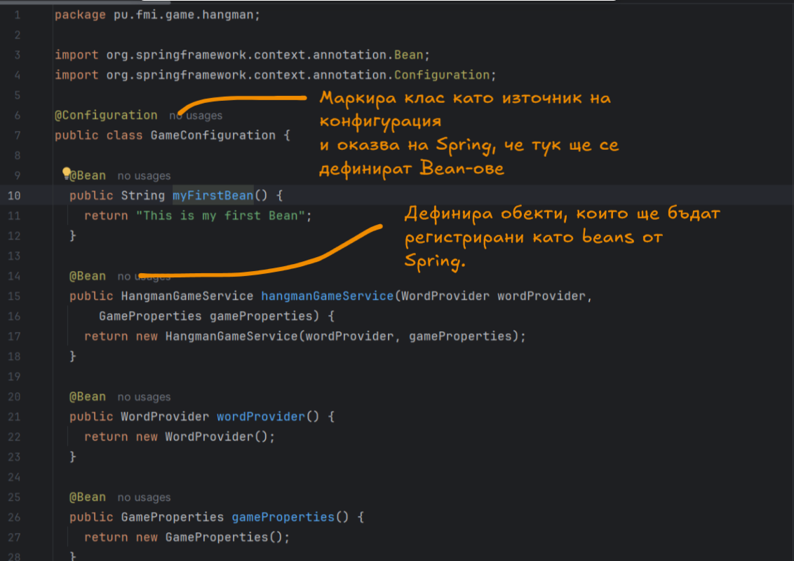
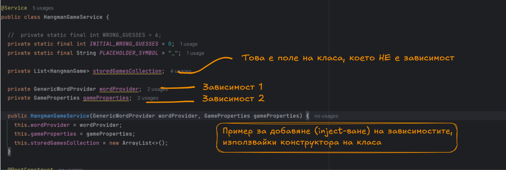
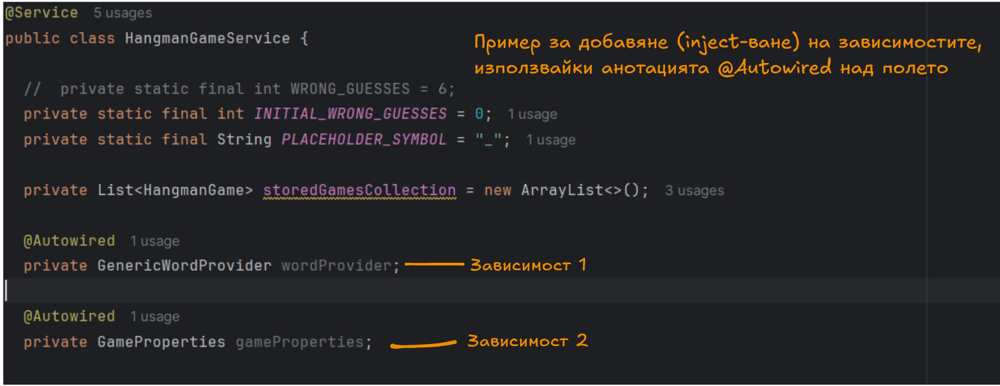
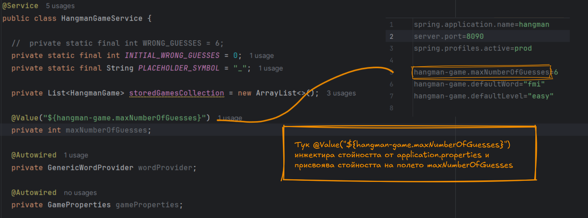
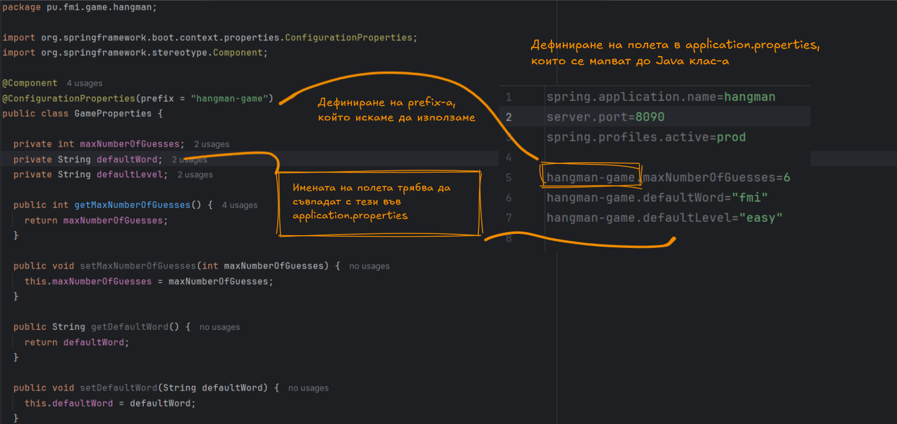

# ***Въведение в Spring Framework?***

## Въведение
Във второто занятие се запознахме с основни концепции, свързани със Spring Framework 
– една от най-популярните Java платформи за разработка на уеб приложения.
Разгледахме как Spring улеснява създаването на съвременни, мащабируеми и 
добре организирани приложения чрез Dependency Injection и Inversion of Control.

В този документ се обобщават основните аспекти на Spring Framework, включително:
- Конфигуриране и използване на @Configuration и @Bean
- Инжектиране на зависимости и работа с компоненти чрез анотации (@Component, @Service, @Repository)
- Използване на Spring Boot за автоматична конфигурация, стартиране на вграден уеб сървър и управление на зависимости

## Съдържание
- [Библиотека и Работна рамка](#library-and-framework)
- [Работната рамка Spring](#spring-framework)
- [Spring Beans](#what-is-spring-beans)
- [Dependency и Dependency Injection](#dependency-injection)
- [Конфигурация в Spring](#configuration)
- [Допълнителни материали](#resources)

## I. Библиотека и Работна рамка

### 1. Библиотека
С развитието на програмирането и нуждата от по-ефективна работа, библиотеките се появяват като естествен отговор на повтарящите се задачи в софтуерната разработка.
Те са основен инструмент в съвременното програмиране. Помагат да бъдем по-ефективни, 
да пишем по-малко, но по-качествен код и да се съсредоточим върху решаването на съществени проблеми.

#### Основни характеристики на библиотеките:
- Съдържат готови класове и методи, които могат да се преизползват.
- Фокусирани са върху конкретна функционалност.
- Програмистът сам решава **кога и как** да използва библиотеката.
- Спестяват време и усилия при разработка.
- Не налагат структура на цялото приложение.

> **Примери за библиотеки в света на Java, които сте срещали**:
> - `java.util` – Структури от данни
> - `java.time` – Работа с дати и часове
> - `java.nio.file` – Работа с файлове
> - `java.math` - Математически изчисления

### 2. Работни рамки (Framework)
С увеличаването на сложността на съвременните приложения, разработката "от нулата" става бавна, 
трудна и податлива на грешки. Именно тук идват на помощ **работните рамки**.

####  Какъв е проблемът:
- Ръчното създаване на уеб сървър
- Управление на HTTP заявки
- Свързване с база данни и писане на SQL
- Валидация на данни и обработка на грешки
- Интеграция на сигурност

#### Какво предлагат работните рамки:
- Представляват **колекция от свързани библиотеки**, които работят заедно.
- Дефинират **структура и последователност на работа**.
- Налагат архитектурен стил и определен начин за решаване на задачи.
- Улесняват и ускоряват създаването на динамични приложения.
- Имат ясен „правилен“ начин за използване – в противен случай приложението може да не работи коректно.

#### С използването на framework (напр. Spring Boot) – получаваш:
- Вграден уеб сървър (Tomcat)
- Автоматична маршрутизация чрез анотации
- Връзка с база чрез Spring Data JPA
- Сигурност чрез Spring Security

> **Примери за работни рамки**:
> - `Spring Framework` – за уеб, бекенд и микросървисни приложения на Java
> - `Angular` – за SPA уеб приложения на TypeScript
> - `Django` – за уеб приложения на Python
> - `Ruby on Rails` – за уеб приложения на Ruby

### 3. Inversion of Control - Основната разлика между библиотека и рамка

#### Какво е Inversion of Control (IoC)?

**Inversion of Control (IoC)** е принцип в софтуерното проектиране, при който **контролът върху изпълнението на програмата се прехвърля от нас към рамката**.

> Вместо нашият код да "контролира нещата", рамката контролира процеса и **извиква нашия код, когато е необходимо**.

В традиционното програмиране, когато нямаме рамка, ние създаваме обекти, свързваме ги помежду им, 
извикваме методите им и управляваме целия процес стъпка по стъпка. 
При IoC този процес се обръща – ние просто казваме какво искаме да се случи, 
а рамката решава кога и как да го направи. 

#### Основната разлика между библиотека и рамка

Тук идва и голямата разлика между библиотеките и работните рамки. При библиотека, 
ние използваме нейните функции по наша преценка – тя е инструмент в нашите ръце. 
Сами решаваме кога и как да я използваме. Например, ако имаме библиотека за сортиране, 
ние извикваме функцията за сортиране в точния момент, когато решим.
При рамките обаче контролът е обърнат. Ние не казваме директно кога да се случат нещата. 

Вместо това, рамката сама извиква нашия код, когато дойде подходящият момент 
– например при HTTP заявка, при стартиране на приложението, при събитие от потребителя и т.н.

### 4. Изводи
- Използването на **библиотеки** ни позволява да преизползваме добре тестван и надежден код, като така повишаваме продуктивността си.
- **Работните рамки** ни предоставят готова архитектура и насоки за по-бърза и ефективна разработка на цялостни приложения.

## II. Работната рамка Spring

### 1. Spring?
Когато говорим за Spring извън рамките на Spring Framework, може да се имат предвид различни 
продукти и технологии, които са създадени или поддържани от Spring Projects. 
Въпреки че Spring Framework е основният продукт на Spring еко-системата, има и други важни 
компоненти и библиотеки, които са свързани с Spring, но не са част от основната рамка.

### 2. Spring Framework

Spring Framework е мощна и широко използвана open-source рамка за разработка на Java приложения. 
Тя предоставя фундаментални концепции и инструменти за изграждането на мащабируеми, гъвкави и 
устойчиви приложения. Spring се е утвърдил като една от основните платформи за разработка на
Java приложения поради своите разнообразни функционалности и леснотата на интеграция с различни технологии.

### 3. Spring Boot
Spring Boot е проект, който е извън основния Spring Framework, но е създаден да работи в тандем с него. 
Той улеснява създаването на Spring приложения чрез:

- Автоматична конфигурация – не е нужно да конфигурирате ръчно множество параметри.
- Вградени сървъри – като Tomcat или Jetty, които не изискват допълнителна конфигурация.
- Минимален код – намалява усилията за настройка и конфигурация.
- Standalone приложения – приложенията могат да се стартират без външен сървър, което прави разгръщането лесно.

### 4. Преди Spring да се зароди

Преди Spring да се зароди, Java разработката е имала няколко основни предизвикателства и ограничения,
които е водела до нуждата от нова рамка, която да улесни и подобри разработката на Java приложения. 
За да разберем контекста, трябва да разгледаме някои от ключовите проблеми, 
с които Java разработчиците са се сблъсквали по това време.

Преди Spring Framework да бъде създаден, Java разработчиците основно използвали 
Enterprise JavaBeans (EJB) и Java EE за изграждане на корпоративни приложения. 
Въпреки че тези технологии предлагат много функционалности, те имат няколко ключови недостатъка:

- конфигурацията и използването на EJB изискват много ръчен код и сложни XML конфигурации.
- трудни за конфигуриране
- производителността на системата се влошавала, заради голямата тежест на приложенията

### 5. Начало на една нова ЕРА - _Finally it is a Spring_
Spring е създаден от Rod Johnson през 2002 година, за да реши тези проблеми, 
като предостави по-лесен и гъвкав начин за изграждане на Java приложения. Основни нововъведения:
- Dependency Injection (DI) за управление на зависимостите, които опростяват кода.
- Inversion of Control (IoC), което позволи на Spring контейнера да управлява жизнения цикъл на обектите.
- По-малко конфигурация и по-лесна интеграция с други технологии.

### 6. Алтернативи на Spring
Има няколко алтернативи на Spring в света на Java разработката, които предлагат различни 
подходи и функционалности за изграждане на приложения.

- Java EE (Jakarta EE)
- Quarkus
- Dropwizard

## III. Spring Beans или обекти, които се управляват от Spring

Spring Beans са основни компоненти в Spring Framework, които се управляват от Spring контейнера. 
Те представляват обекти, които са създадени, конфигурирани и управлявани от Spring контейнера в 
процеса на изпълнение на приложението. В контекста на Spring, концепцията за beans играе основна роля
в зависимостите и конфигурацията на обектите, благодарение на Inversion of Control (IoC) и Dependency Injection (DI).

### 1. Какво представлява Spring Bean?

Spring Bean е просто обект, който е управляван от Spring контейнера. Обектите в Spring приложения не
се създават ръчно от програмата, а вместо това Spring контейнерът поема отговорността за
тяхното създаване и управление. Когато говорим за Spring Beans, имаме предвид обекти, 
които са част от контекста на приложението (ApplicationContext).

В Spring Framework, bean-овете не се създават чрез стандартния оператор **new**, а чрез Inversion of Control (IoC) контейнера.
Това означава, че Spring управлява целия жизнен цикъл на обектите в приложението, започвайки от тяхното създаване и инициализация до унищожението им.

### 2. Как да дефинираме Bean?

#### **2.1 В XML конфигурация**: 
В миналото Spring е използвал XML конфигурационни файлове за дефиниране на bean-ове. 

#### **2.2 Чрез Java конфигурация**:  
В по-новите версии на Spring, конфигурирането на beans се 
извършва с Java конфигурация чрез използване на @Configuration и @Bean анотации.

> ##### @Configuration:
> Тази анотация в Spring, се използва за маркиране на класове,
> които съдържат конфигурация за Spring контекста. Класовете, анотирани с @Configuration,
> предоставят Java-базирана конфигурация, която замества традиционните XML конфигурации в Spring.

> ##### @Bean:
>Тази анотация, позволява на разработчиците да дефинират
>компоненти (обекти), които трябва да бъдат управлявани от Spring контейнера.
>Тази анотация се поставя върху методи в конфигурационни класове, а самият метод връща
>инстанция на обект, който ще бъде регистриран като bean.

#### **2.3 С използване на анотации като @Component, @Service, @Repository и @Controller**

Spring осигурява множество специализирани анотации за автоматично дефиниране на beans, които могат да бъдат сканирани и регистрирани в Spring контейнера
Тези анотации правят класовете beans, които Spring ще управлява. 
В зависимост от контекста можете да използвате различни анотации:

>- **@Component:** Общата анотация за всеки компонент.

>- **@Service:** Използва се за компоненти, които предоставят бизнес логика.

>- **@Repository:** Използва се за компоненти, които взаимодействат с базата данни (DAO).

>- **@Controller:** Използва се за класове, които обработват HTTP заявки (например в Spring MVC приложения).

С помощта на @Component (или други специализирани анотации като 
@Service, @Repository, и т.н.), класът ще бъде автоматично сканиран и регистриран като bean от Spring контейнера.

### 3. Жизнен цикъл на Spring Bean:

Spring IoC контейнерът е отговорен за създаването, конфигурирането и управляването на всички beans, които са част от приложението. 
Тези beans се създават по специфичен начин и преминават през няколко етапа, включително инициализация и унищожение.

#### 3.1 Създаване на Bean:

Spring IoC контейнерът отговаря за създаването на обектите. Когато приложението стартира, 
Spring сканира конфигурациите за дефиниции на beans, които са или анотирани с @Component, @Service,
@Repository, или дефинирани чрез @Bean в конфигурационни класове.

Spring използва Reflection API за създаване на инстанции от тези класове. Така например, ако имате клас,
който е дефиниран като bean с анотация @Service, Spring ще извика конструктор на този клас и ще създаде обект от него.

#### 3.2 Инициализация на Bean:
След като bean-ът бъде създаден, следва етапът на инициализация. На този етап могат да бъдат 
изпълнени допълнителни операции, като задаване на стойности на полета, конфигуриране на
зависимости или изпълнение на специални методи.

> ##### 3.2.1 @PostConstruct:
> Анотацията @PostConstruct в Spring (и Java EE) е специална анотация, която се използва за
> означаване на методи, които трябва да бъдат изпълнени веднага след като даден bean бъде
> създаден и инициализиран. Това е удобен начин да извършите операции за настройка или
> инициализация на bean-а, които трябва да се случат след инжектиране на зависимостите, но преди bean-ът да започне да се използва.

#### 3.3 Използване на Bean:
След като bean-ът бъде създаден и инициализиран, той е готов за използване. 
Това може да включва извикване на методи на обекта, взаимодействие с други beans или изпълнение на основната логика на приложението.

#### 3.4 Унищожение на Bean:
След като bean-ът е използван и вече не е необходим, той преминава през етапа на унищожение. 
В този момент Spring освобождава ресурсите, които са били заделени за него, и извършва всички необходими операции за почистване на bean-а.

> ##### 3.4.1 @PreDestroy:
> Анотацията @PreDestroy в Spring (и Java EE) се използва за означаване на методи,
> които трябва да бъдат извикани преди да бъде унищожен bean-а. Тази анотация предоставя
> начин за извършване на операции за почистване или освобождаване на ресурси преди bean-ът да бъде премахнат от Spring IoC контейнера.

## IV. Какво е Dependency и как Spring го инжектира, когато се налага

### 1. Какво е Dependency (зависимост)?
Dependency (зависимост) е обект, от който друг обект зависи, за да изпълнява правилно своята логика. 
Например, ако един клас използва друг клас, за да съхранява данни в база, този втори клас е негова зависимост.

> ⚠️ **Важно:**  
> За да може Spring да инжектира един клас като зависимост, той **задължително трябва да бъде дефиниран като bean** в Spring контекста.  
> Това може да стане чрез анотации като `@Component`, `@Service`, `@Repository`, `@Controller` или чрез ръчно дефиниране с `@Bean` в конфигурационен клас.

### 2. Какво е Dependency Injection (DI)?
Dependency Injection (DI) е механизъм, при който вместо класът сам да създава своите зависимости, 
те му се предоставят отвън (инжектират) от Spring. Това улеснява тестването, поддръжката и разширяването на приложенията.

### 3. Как Spring инжектира зависимости?

#### 3.1 Чрез конструктор – най-препоръчителният начин:
Състои се в предоставянето на зависимостите чрез конструктора на класа.
Това е най-ясният и най-ясно дефиниран начин за инжектиране на зависимости,
защото всички зависимостите трябва да бъдат подадени при създаването на обекта.

#### 3.2 Чрез setter метод - обикновенно се използва за опционални зависимости:
Използва setter методи за инжектиране на зависимости след създаването на обекта.
Това е по-гъвкав начин за извършване на DI, като позволява на зависимостите да се
задават след инициализацията на обекта.

#### 3.3 Чрез директно инжектиране в поле (field injection):
Чрез директно инжектиране в поле (или field injection) означава, че зависимостите се инжектират директно
в полетата на класа, без да е необходимо използването на конструктор или setter методи. 
Това се прави чрез анотацията **@Autowired**, приложена върху полето, което трябва да бъде инжектирано.

## V. Конфигурация в Spring
Spring предлага мощни възможности за конфигуриране на приложения чрез автоматична конфигурация и 
външни конфигурационни файлове, като application.properties или application.yml. 
Един от начините да се използва конфигурация в Spring е чрез анотацията @ConfigurationProperties, 
която помага за свързването на стойности от конфигурационните файлове с класове в приложението.

### 1. Автоматична конфигурация в Spring
Автоматичната конфигурация (или auto-configuration) е една от основните характеристики на Spring Boot. 
Тя позволява на Spring да конфигурира автоматично част от компонентите на приложението, 
базирано на класовете и библиотеките, които са включени в проекта.

### 2. application.properties
Това е конфигурационен файл, използван в Spring Boot приложения 
за съхраняване на настройки и параметри, които управляват поведението на приложението. 
Този файл позволява лесно конфигуриране на различни аспекти на приложението, 
като например настройки на база данни, порт на сървъра, логиране, и други. 
В Spring Boot, стойностите в този файл могат да се използват за настройване на
компоненти, които ще бъдат инжектирани в приложението.

### 3. @Value
Анотацията @Value в Spring се използва за инжектиране на стойности от конфигурационни файлове 
(application.properties), системни променливи или изрази, директно в полетата на класовете. 
Това е един от начините да свържеш външни настройки с Java класи.

### 4. @ConfigurationProperties – Какво е и как се използва?
Анотацията **@ConfigurationProperties** позволява свързването на конфигурационни стойности от 
application.properties директно с Java клас. 
Това е много удобно, когато имате група от свързани конфигурационни параметри и искате
да ги съберете в един клас, вместо да ги четете поотделно.

#### 4.1 Как работи?
1. Създаваш Java клас, който съдържа полета, съвпадащи с имената на параметрите в конфигурационния файл.
2. Използваш анотацията **@ConfigurationProperties** върху този клас, за да го направиш конфигурационен bean.
3. В конфигурационния клас се декларира префикс, за да се изолира групата настройки, които ще бъдат инжектирани.

## VI. Допълнителни материали

- [Spring Tutorial](https://www.baeldung.com/spring-tutorial)
- [Spring Boot](https://www.baeldung.com/spring-boot) 
